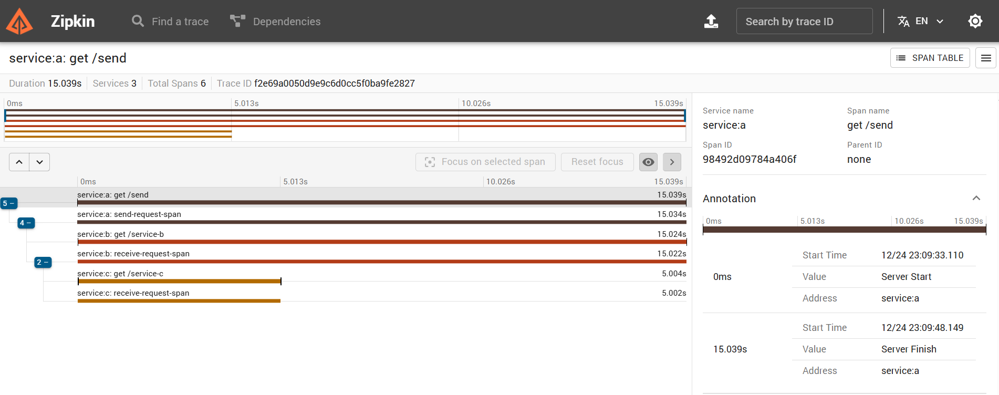

# OpenTelemetry Distributed Tracing

## Overview

**OpenTelemetry Distributed Tracing** is a microservices-based project designed to demonstrate **end-to-end distributed tracing** using **OpenTelemetry**.
The project consists of **three interacting microservices** instrumented with the **OpenTelemetry SDK**, allowing end-to-end request tracing across service boundaries.

An **OpenTelemetry Collector** is configured as a centralized telemetry pipeline to collect trace data and export it to **Zipkin** for visualization and analysis.

This project showcases real-world observability concepts commonly used in modern cloud-native architectures.

---

## Architecture

```
Client
  ↓
Service A
  ↓
Service B
  ↓
Service C
  ↓
OpenTelemetry Collector
  ↓
Zipkin
```

* Each service propagates trace context to downstream services
* A single request can be tracked end-to-end across all microservices
* Zipkin provides visualization of latency, spans, and service dependencies

---

## Key Features

* 🧩 **Microservices Architecture**
  * Three independent services communicating with each other
    
* 🔍 **Distributed Tracing**
  * Request tracing across services using OpenTelemetry SDK
    
* 📡 **OpenTelemetry Collector**
  * Centralized telemetry collection and export
    
* 📊 **Zipkin Integration**
  * Visualize traces, spans, and service dependencies
    
* ☁️ **Cloud-Native Observability**
  * Demonstrates production-grade tracing patterns

---

## Tech Stack

* **Language**: Python
* **Tracing**: OpenTelemetry SDK
* **Telemetry Backend**: Zipkin
* **Collector**: OpenTelemetry Collector
* **Containerization**: Docker
* **Orchestration**: Kubernetes

---

## Build & Deployment

This repository provides **Dockerfiles** for each microservice along with **Kubernetes deployment manifests**.

Docker images are **not pre-built** and are expected to be created locally or via CI/CD pipelines before deployment, following standard production practices.

---

## How Tracing Works

1. A request enters **Service A**
2. A root span is created using OpenTelemetry
3. Trace context is propagated to **Service B** and **Service C**
4. Each service creates its own spans
5. All spans are sent to the **OpenTelemetry Collector**
6. Collector exports traces to **Zipkin**
7. Traces can be visualized via Zipkin UI

---

## Zipkin UI

Once the system is running, traces can be viewed at:

```
http://localhost:9411
```

You can:

* Search traces by service name
* Analyze request latency
* Visualize span hierarchy

---

## Sample Distributed Trace (Zipkin)

The screenshot below shows a **single request trace captured in Zipkin**, demonstrating
end-to-end request flow across all three microservices.

The trace highlights:

* Root span created in **Service A**
* Downstream calls to **Service B** and **Service C**
* Proper parent-child span relationships
* Latency contribution of each service



---
## Learning Outcomes

This project demonstrates:

* Distributed tracing fundamentals
* Trace context propagation across services
* Observability in microservices
* Practical usage of OpenTelemetry SDK
* Integration with tracing backends like Zipkin

---

## Future Enhancements

* Add metrics and logs using OpenTelemetry
* Introduce error and retry scenarios
* Add Kubernetes deployment manifests with Helm
* Integrate Grafana Tempo or Jaeger
* Add latency and dependency dashboards
